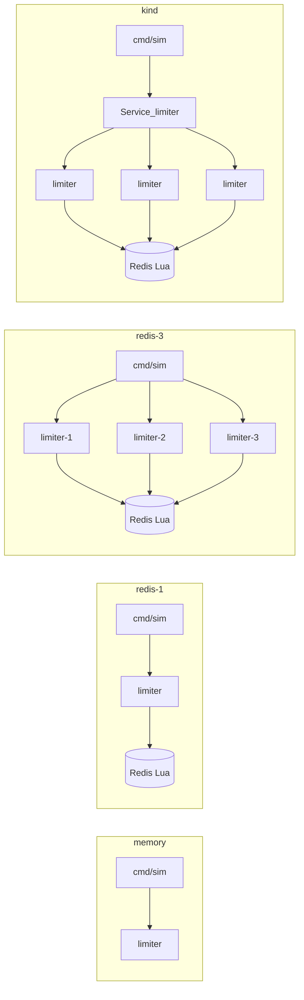

# Overview
## Purpose
Create a rate-limiting gRPC service for endpoint requests  
Create a shared state to prepare for the deployment of multiple service nodes  
Containerize, monitor, and deploy with Docker + AWS services  
Create a simulator in Go as a test harness for the service  
Create a simple UI to call the simulator with custom parameters  
Load test and expose metrics for the service  

## Learning points
- Practice with gRPC
- Concurrency safety in Go
  - Performance of goroutines vs threads
- Rate limiting algorithms
- Distributed systems
- System design
- Load testing and performance monitoring
  - utilizing my own simulator and k6 to expose different metrics
- Per-node token lease cache so Redis is not on the hot path of every Allow
- Fallback for Redis downtime
# Architecture 
  
## Application Layer Tech Stack
Go - Simulator Client, gRPC Service  
Docker - Multiple nodes  
Redis - Shared state + atomic coordination across nodes  
Kubernetes - Kind locally, EKS later (Deployment + Service in front of limiter replicas)  
(TBD) React - Simple UI for simulator  
(TBD) Prometheus/Grafana - Metrics + UI  

## Deployment

**Compose (laptop)** → **Kind (learn Kubernetes)** → **EKS (AWS)** → **Terraform** (VPC, EKS, ECR, later ElastiCache).

- Compose stays the fast local loop: Redis + limiter containers, optional three-replica overlay.
- Kind applies the same idea as Kubernetes objects: 3 limiter pods, 1 Redis StatefulSet, a **ClusterIP Service** as the first load balancer in front of the limiter Deployment. See [`deploy/k8s/README.md`](deploy/k8s/README.md).
- EKS reuses those manifests via the `eks` overlay (ECR images, `gp3` disk, internal NLB for gRPC). Do not leave an EKS cluster running idle; the control plane is billed.
- Terraform should create AWS infra later, not rewrite the Go service. In-cluster Redis is a single replica (not HA); ElastiCache is the managed next step.

## Distributed State (Redis)
- Atomic Lua scripting (`EVAL` / `EVALSHA` / `SCRIPT LOAD`) keeps refill, limit check, and token decrement in one server-side transaction so concurrent nodes cannot oversubscribe a bucket.
- Server-side `TIME` is used inside the script to avoid clock skew between limiter nodes; tests can override time via script arguments to keep deterministic coverage.
- Per-key state is stored in a single hash with `tokens` and `last_refill_us`, which keeps reads/writes in one round trip and one atomic write path.
- `PEXPIRE` is refreshed on each write so idle buckets are automatically evicted and keyspace growth stays bounded over time.
- Key namespacing uses `{prefix}:tb:{userKey}` to separate environments and keep a stable hash-tag pattern for Redis Cluster slot placement.
- Connection pooling is handled by `go-redis`; per-node pool size should be tuned to expected concurrency and latency targets.
- Failure behavior is currently deny-by-default when Redis is unavailable (errors bubble up); fail-open or fallback modes are tracked as separate follow-up work.
- Cross-node consistency is strong per key because all bucket updates serialize through the same Redis primary.
- Optional per-node lease cache (`lease_size` > 1) checks out a handful of tokens from Redis in one Lua script, then spends them locally. Redis still never grants more than the jar holds, so a hot-key burst stays at 0 oversubscription; unused tokens sitting in a node pocket can make other nodes look empty until refill.

## Simulator
The simulator is a Go CLI test harness for the gRPC rate limiter. It sends
configurable `Allow` requests to a running limiter service so you can quickly
exercise in-memory or Redis-backed token bucket behavior during local
development.

The CLI can vary request count, concurrency, key cardinality, resource, cost,
per-RPC timeout, retry/backoff behavior, request dispatch rate, and whether to
reset or reconfigure limiter state before a run. Its summary reports allowed,
denied, and error totals along with offered vs allowed throughput, p50/p95/p99
latency, expected-token oversubscription, error categories, and the latest
`remaining` / `reset_time` metadata returned by the service. Each run also
writes a JSON summary for later analysis.

Example:

```sh
go run ./cmd/sim -addr localhost:50051 -requests 100 -concurrency 10 -keys 5 -reset
```

See [`cmd/sim/README.md`](cmd/sim/README.md) for the full flag reference and
additional examples.

## Docker Compose

The local Compose stack runs Redis and the gRPC limiter service with the
Redis-backed token bucket config from `config/limiter.docker.yaml`.

Start the stack:

```sh
docker compose up --build redis limiter
```

Run the simulator against the Compose network:

```sh
docker compose --profile tools run --rm --build sim
```

The limiter is exposed on `localhost:50051`, and Redis is exposed on
`localhost:6379` for local inspection.

Three limiter replicas sharing one Redis (used by the redis-3 scenarios below):

```sh
docker compose -f docker-compose.yml -f docker-compose.multi.yml up --build redis limiter-1 limiter-2 limiter-3
```

The replicas are published on `localhost:50051`, `localhost:50052`, and `localhost:50053`. Compose does not load-balance those ports; pass a comma-separated `-addr` list to the simulator, or use Kubernetes (below) so a Service does it.

## Kubernetes (Kind)

Build images, load them into Kind, and apply the Kind overlay. Kind nodes cannot see laptop images until `kind load`.

```sh
kind create cluster --name golimiter
docker build --target limiter -t golimiter/limiter:dev .
docker build --target sim -t golimiter/sim:dev .
kind load docker-image golimiter/limiter:dev --name golimiter
kind load docker-image golimiter/sim:dev --name golimiter
kubectl apply -k deploy/k8s/overlays/kind
kubectl -n golimiter port-forward svc/limiter 50051:50051
```

Then run the same benchmark suite used for Compose (waits for Deployment + Redis, then port-forwards the Service if needed):

```sh
./scripts/run-scenarios.sh kind
./scripts/run-scenarios.sh kind-lease
```

A one-shot smoke test:

```sh
go run ./cmd/sim -addr localhost:50051 -requests 100 -concurrency 10 -reset
```

Object glossary, EKS overlay notes, and `kubectl` cheatsheet: [`deploy/k8s/README.md`](deploy/k8s/README.md).

## Local testing metrics

These numbers come from `scripts/run-scenarios.sh` against the same four scenarios on Compose and Kind. Compose rows: 2026-09-05 UTC. Kind rows: 2026-09-11 UTC. Same machine: WSL2 (`AMD Ryzen 9 7900X`, 24 threads). Kind `kind` is the fair compare to `redis-3` (three limiter processes, one Redis); `kind` goes through the ClusterIP Service + port-forward (one gRPC connection), while `redis-3` round-robins three host ports.



Two experiment classes:

- **Correctness** uses a tight token bucket. `burst-hotkey` sets `capacity=10` and `refill_rate=0.001`, then sends 200 concurrent Allows on one key. `sustained-limit` sets `capacity=10` and `refill_rate=5`, then offers 25 RPS for 300 requests. Expected tokens are `capacity + refill_rate * elapsed`; oversubscription is tokens granted above that cap.
- **Performance** uses a wide-open bucket so the limiter is not the bottleneck. `cardinality-hot` vs `cardinality-wide` compares one key to 1000 keys at 2000 requests / 100 workers. `saturation` sweeps concurrency 1, 10, 50, 100, 200 with 5000 Allows.

Reproduce after starting the matching topology (`go run ./cmd/limiter` for memory, Compose for Redis, Kind cluster for `kind`):

```sh
./scripts/run-scenarios.sh memory
./scripts/run-scenarios.sh redis-1
./scripts/run-scenarios.sh redis-3
./scripts/run-scenarios.sh kind
```

JSON dumps land under `benchmarks/results/<target>/`. Make targets: `make -C scripts scenarios-memory`, `scenarios-redis-1`, `scenarios-redis-3`, `scenarios-redis-1-lease`, `scenarios-redis-3-lease`, `scenarios-kind`, `scenarios-kind-lease`.

### Correctness and cardinality

| target | scenario | allowed | denied | errors | allowed/s | expected tokens | oversub | p50 ms | p99 ms | offered RPS |
|---|---|---:|---:|---:|---:|---:|---:|---:|---:|---:|
| memory | burst-hotkey | 10 | 190 | 0 | 1866.20 | 10.0000 | 0.0000 | 0.883 | 2.607 | 37323.93 |
| memory | sustained-limit | 69 | 231 | 0 | 5.75 | 70.0049 | 0.0000 | 0.451 | 0.699 | 25.00 |
| memory | cardinality-hot | 2000 | 0 | 0 | 57484.72 | — | 0.0000 | 1.645 | 3.061 | 57484.72 |
| memory | cardinality-wide | 2000 | 0 | 0 | 60931.90 | — | 0.0000 | 1.445 | 2.719 | 60931.90 |
| redis-1 | burst-hotkey | 10 | 190 | 0 | 632.73 | 10.0000 | 0.0000 | 2.324 | 13.127 | 12654.65 |
| redis-1 | sustained-limit | 66 | 234 | 0 | 5.50 | 70.0086 | 0.0000 | 0.878 | 1.255 | 25.00 |
| redis-1 | cardinality-hot | 2000 | 0 | 0 | 34823.05 | — | 0.0000 | 2.590 | 5.501 | 34823.05 |
| redis-1 | cardinality-wide | 2000 | 0 | 0 | 34983.46 | — | 0.0000 | 2.650 | 4.549 | 34983.46 |
| redis-3 | burst-hotkey | 10 | 190 | 0 | 771.22 | 10.0000 | 0.0000 | 2.037 | 7.581 | 15424.45 |
| redis-3 | sustained-limit | 66 | 234 | 0 | 5.50 | 70.0087 | 0.0000 | 0.882 | 1.363 | 25.00 |
| redis-3 | cardinality-hot | 2000 | 0 | 0 | 14870.72 | — | 0.0000 | 3.259 | 45.900 | 14870.72 |
| redis-3 | cardinality-wide | 2000 | 0 | 0 | 27887.49 | — | 0.0000 | 3.382 | 6.473 | 27887.49 |
| kind | burst-hotkey | 10 | 190 | 0 | 102.15 | 10.0001 | 0.0000 | 7.393 | 32.874 | 2042.97 |
| kind | sustained-limit | 69 | 231 | 0 | 5.75 | 70.0205 | 0.0000 | 3.275 | 6.567 | 24.99 |
| kind | cardinality-hot | 2000 | 0 | 0 | 2861.87 | — | 0.0000 | 17.836 | 86.675 | 2861.87 |
| kind | cardinality-wide | 2000 | 0 | 0 | 2678.48 | — | 0.0000 | 42.505 | 90.589 | 2678.48 |

Wide-open cardinality rows omit expected-token magnitude; the bucket is `1e9` capacity / refill so the cap is not the interesting number. Oversubscription stayed 0.

Hot-key burst of 200 concurrent Allows granted exactly 10 tokens on every topology, including three limiter processes sharing Redis (Compose and Kind). Under 25 RPS offered load against a 5 token/s bucket, allow-rate stayed at 5.50–5.75/s (initial burst of 10 tokens plus refill) with 0 oversubscription.

Kind matches redis-3 on **correctness** (burst 10/190, sustained ~5.75 allow/s, zero oversub) and is slower on **throughput**: cardinality-hot is ~2.9k RPS vs ~14.9k on redis-3, and p99 jumps to ~87ms vs ~46ms. That gap is mostly the extra hop (laptop → port-forward → Kind node → Service → pod) plus one multiplexed gRPC connection to the Service instead of client-side round-robin across three Compose ports.

### Saturation

Wide-open bucket, 5000 Allows, no errors in this sweep. p99 is the useful signal.

| target | concurrency | offered RPS | p50 ms | p99 ms | max ms |
|---|---:|---:|---:|---:|---:|
| memory | 1 | 4635.14 | 0.205 | 0.388 | 0.962 |
| memory | 10 | 28250.67 | 0.316 | 0.837 | 1.112 |
| memory | 50 | 55908.46 | 0.747 | 1.869 | 3.359 |
| memory | 100 | 66305.88 | 1.335 | 2.992 | 3.719 |
| memory | 200 | 77646.77 | 2.338 | 5.715 | 7.474 |
| redis-1 | 1 | 1951.26 | 0.501 | 0.760 | 1.582 |
| redis-1 | 10 | 13934.29 | 0.694 | 1.231 | 1.630 |
| redis-1 | 50 | 28978.39 | 1.601 | 3.571 | 5.159 |
| redis-1 | 100 | 36815.86 | 2.545 | 4.851 | 6.008 |
| redis-1 | 200 | 41488.17 | 4.506 | 8.214 | 10.255 |
| redis-3 | 1 | 1832.82 | 0.533 | 0.833 | 1.539 |
| redis-3 | 10 | 13811.38 | 0.699 | 1.207 | 2.119 |
| redis-3 | 50 | 29939.13 | 1.613 | 2.758 | 3.523 |
| redis-3 | 100 | 29184.41 | 3.280 | 4.953 | 6.311 |
| redis-3 | 200 | 32686.82 | 5.769 | 10.170 | 19.815 |
| kind | 1 | 408.03 | 2.373 | 3.842 | 8.396 |
| kind | 10 | 1721.05 | 2.908 | 43.033 | 46.761 |
| kind | 50 | 3026.58 | 5.664 | 76.590 | 80.274 |
| kind | 100 | 3072.48 | 16.535 | 87.551 | 91.700 |
| kind | 200 | 3101.03 | 59.251 | 98.278 | 101.526 |

In-memory Allow peaked at about 78k RPS (p99 5.7ms at 200 workers). Redis Lua on one node peaked at about 41k RPS (p99 8.2ms). Three replicas sharing Redis peaked at about 33k RPS; p99 stayed under 3ms through 50 workers and crossed 10ms at 200. On redis-3, a hot key at 100 workers had a much worse tail (p99 45.9ms) than 1000 keys (p99 6.5ms). Kind through the Service plateaued around **3.1k RPS** (p99 ~98ms at 200 workers): extra latency from port-forward and a single HTTP/2 connection, not a change in Redis token-bucket math.

### Token lease cache (`lease_size=10`)

Same scenarios, same machine, with each limiter node checking out 10 tokens from Redis per miss and serving later Allows from a local pocket. Enable it with `-lease-size 10` on Configure (the scenario targets `redis-1-lease`, `redis-3-lease`, and `kind-lease`).

Redis still deducts the checkout atomically, so the global jar cannot be overdrawn. Nodes can hog unused pocket tokens, which is why a tight bucket does not get much faster, and why allow-rate on `sustained-limit` sits a little further under the expected refill.

| target | scenario | allowed | denied | errors | oversub | p50 ms | p99 ms | offered RPS |
|---|---|---:|---:|---:|---:|---:|---:|---:|
| redis-1-lease | burst-hotkey | 10 | 190 | 0 | 0.0000 | 1.265 | 3.823 | 28337.03 |
| redis-1-lease | sustained-limit | 65 | 235 | 0 | 0.0000 | 0.854 | 1.139 | 25.00 |
| redis-1-lease | cardinality-hot | 2000 | 0 | 0 | 0.0000 | 2.054 | 7.623 | 39405.20 |
| redis-1-lease | cardinality-wide | 2000 | 0 | 0 | 0.0000 | 2.004 | 11.119 | 39691.37 |
| redis-3-lease | burst-hotkey | 10 | 190 | 0 | 0.0000 | 1.407 | 4.157 | 25305.77 |
| redis-3-lease | sustained-limit | 64 | 236 | 0 | 0.0000 | 0.867 | 1.317 | 25.00 |
| redis-3-lease | cardinality-hot | 2000 | 0 | 0 | 0.0000 | 1.325 | 3.780 | 61725.43 |
| redis-3-lease | cardinality-wide | 2000 | 0 | 0 | 0.0000 | 3.497 | 49.927 | 16978.59 |
| kind-lease | burst-hotkey | 10 | 190 | 0 | 0.0000 | 3.532 | 5.406 | 11360.00 |
| kind-lease | sustained-limit | 69 | 231 | 0 | 0.0000 | 2.909 | 3.998 | 24.99 |
| kind-lease | cardinality-hot | 2000 | 0 | 0 | 0.0000 | 6.867 | 80.034 | 4933.66 |
| kind-lease | cardinality-wide | 2000 | 0 | 0 | 0.0000 | 12.300 | 53.680 | 4850.81 |

Burst oversubscription stayed 0 on one and three replicas. The hot-key win is the point of the cache: redis-3 cardinality-hot went from **14.9k RPS / p99 45.9ms** without leases to **61.7k RPS / p99 3.8ms**. Wide cardinality on three nodes got worse (p99 50ms) because 1000 keys still miss to Redis; the pocket only helps when the same key is reused. Kind saw the same correctness (burst 10/190, 0 oversub) and a smaller speedup: cardinality-hot **2.9k → 4.9k RPS**, burst p99 **33ms → 5.4ms**. Port-forward still caps the ceiling versus Compose.

| target | concurrency | offered RPS | p50 ms | p99 ms | max ms |
|---|---:|---:|---:|---:|---:|
| redis-1-lease | 1 | 2767.96 | 0.333 | 0.638 | 1.021 |
| redis-1-lease | 10 | 15793.83 | 0.605 | 1.020 | 1.618 |
| redis-1-lease | 50 | 42828.63 | 1.027 | 2.839 | 3.927 |
| redis-1-lease | 100 | 43491.89 | 1.837 | 8.125 | 15.141 |
| redis-1-lease | 200 | 43264.86 | 3.092 | 21.414 | 37.730 |
| redis-3-lease | 1 | 2702.91 | 0.347 | 0.672 | 1.018 |
| redis-3-lease | 10 | 17402.03 | 0.513 | 1.129 | 3.610 |
| redis-3-lease | 50 | 51780.12 | 0.834 | 2.160 | 2.877 |
| redis-3-lease | 100 | 71992.41 | 1.131 | 3.257 | 4.988 |
| redis-3-lease | 200 | 84992.58 | 1.840 | 5.768 | 8.768 |
| kind-lease | 1 | 512.31 | 1.862 | 3.209 | 8.382 |
| kind-lease | 10 | 3928.54 | 2.412 | 4.825 | 8.891 |
| kind-lease | 50 | 5420.11 | 3.823 | 46.226 | 75.253 |
| kind-lease | 100 | 5238.38 | 6.915 | 79.245 | 87.446 |
| kind-lease | 200 | 5555.93 | 36.577 | 139.363 | 300.992 |

Single-node Redis saturation is similar at the top (~43k vs ~41k RPS) with a better p50 at low concurrency (0.33ms vs 0.50ms) and a worse tail at 200 workers. Three replicas plus leases peaked at **~85k RPS, p99 5.8ms**, above the in-memory single-process run, because most Allows never wait on Redis. Kind-lease peaked around **5.6k RPS** (vs ~3.1k without leases); p99 at 10 workers dropped from 43ms to 4.8ms, then the tail grew again at 50+ workers on the single port-forward connection.

```sh
./scripts/run-scenarios.sh redis-1-lease
./scripts/run-scenarios.sh redis-3-lease
./scripts/run-scenarios.sh kind-lease
```
