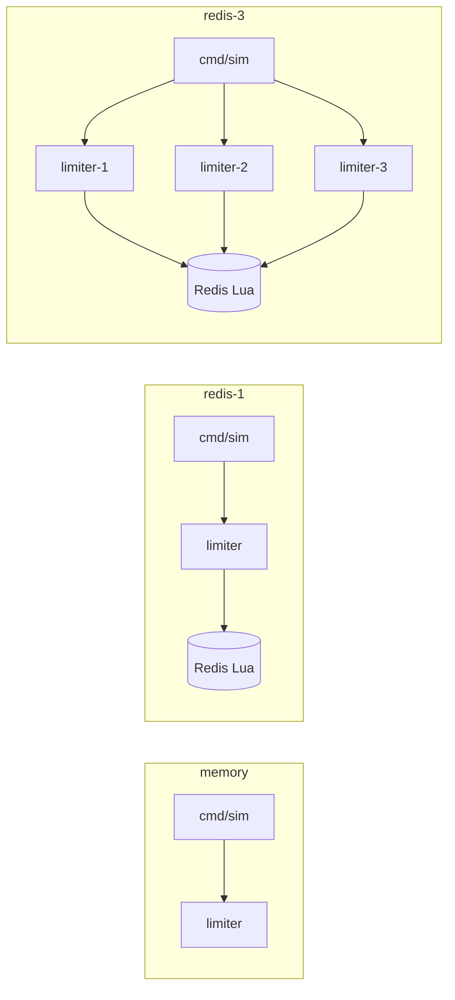

# Overview
## Purpose
Create a rate-limiting gRPC service for endpoint requests  
Create a shared state to prepare for the deployment of multiple service nodes  
Containerize, monitor, and deploy with Docker + AWS services  
Create a simulator in Go as a test harness for the service  
Create a simple UI to call the simulator with custom parameters  
Load test and expose metrics for the service  

## Learning points
- Practice with gRPC
- Concurrency safety in Go
  - Performance of goroutines vs threads
- Rate limiting algorithms
- Distributed systems
- System design
- Load testing and performance monitoring
  - utilizing my own simulator and k6 to expose different metrics
- In-memory caching for Redis optimization
- Fallback for Redis downtime
# Architecture 
  
## Application Layer Tech Stack
Go - Simulator Client, gRPC Service  
Docker - Multiple nodes  
Redis - Shared state + atomic coordination across nodes  
(TBD) React - Simple UI for simulator  
(TBD) Prometheus/Grafana - Metrics + UI  

## (TBD) Deployment
EC2 → Docker Compose → Nginx/Traefik → 2-3 limiter containers + Redis

## Distributed State (Redis)
- Atomic Lua scripting (`EVAL` / `EVALSHA` / `SCRIPT LOAD`) keeps refill, limit check, and token decrement in one server-side transaction so concurrent nodes cannot oversubscribe a bucket.
- Server-side `TIME` is used inside the script to avoid clock skew between limiter nodes; tests can override time via script arguments to keep deterministic coverage.
- Per-key state is stored in a single hash with `tokens` and `last_refill_us`, which keeps reads/writes in one round trip and one atomic write path.
- `PEXPIRE` is refreshed on each write so idle buckets are automatically evicted and keyspace growth stays bounded over time.
- Key namespacing uses `{prefix}:tb:{userKey}` to separate environments and keep a stable hash-tag pattern for Redis Cluster slot placement.
- Connection pooling is handled by `go-redis`; per-node pool size should be tuned to expected concurrency and latency targets.
- Failure behavior is currently deny-by-default when Redis is unavailable (errors bubble up); fail-open or fallback modes are tracked as separate follow-up work.
- Cross-node consistency is strong per key because all bucket updates serialize through the same Redis primary.

## Simulator
The simulator is a Go CLI test harness for the gRPC rate limiter. It sends
configurable `Allow` requests to a running limiter service so you can quickly
exercise in-memory or Redis-backed token bucket behavior during local
development.

The CLI can vary request count, concurrency, key cardinality, resource, cost,
per-RPC timeout, retry/backoff behavior, request dispatch rate, and whether to
reset or reconfigure limiter state before a run. Its summary reports allowed,
denied, and error totals along with offered vs allowed throughput, p50/p95/p99
latency, expected-token oversubscription, error categories, and the latest
`remaining` / `reset_time` metadata returned by the service. Each run also
writes a JSON summary for later analysis.

Example:

```sh
go run ./cmd/sim -addr localhost:50051 -requests 100 -concurrency 10 -keys 5 -reset
```

See [`cmd/sim/README.md`](cmd/sim/README.md) for the full flag reference and
additional examples.

## Docker Compose

The local Compose stack runs Redis and the gRPC limiter service with the
Redis-backed token bucket config from `config/limiter.docker.yaml`.

Start the stack:

```sh
docker compose up --build redis limiter
```

Run the simulator against the Compose network:

```sh
docker compose --profile tools run --rm --build sim
```

The limiter is exposed on `localhost:50051`, and Redis is exposed on
`localhost:6379` for local inspection.

Three limiter replicas sharing one Redis (used by the redis-3 scenarios below):

```sh
docker compose -f docker-compose.yml -f docker-compose.multi.yml up --build redis limiter-1 limiter-2 limiter-3
```

The replicas are published on `localhost:50051`, `localhost:50052`, and `localhost:50053`.

## Local testing metrics

These numbers come from `scripts/run-scenarios.sh` against the same four scenarios on three topologies. Collected 2026-09-05 UTC on WSL2 (`AMD Ryzen 9 7900X`, 24 threads).



Two experiment classes:

- **Correctness** uses a tight token bucket. `burst-hotkey` sets `capacity=10` and `refill_rate=0.001`, then sends 200 concurrent Allows on one key. `sustained-limit` sets `capacity=10` and `refill_rate=5`, then offers 25 RPS for 300 requests. Expected tokens are `capacity + refill_rate * elapsed`; oversubscription is tokens granted above that cap.
- **Performance** uses a wide-open bucket so the limiter is not the bottleneck. `cardinality-hot` vs `cardinality-wide` compares one key to 1000 keys at 2000 requests / 100 workers. `saturation` sweeps concurrency 1, 10, 50, 100, 200 with 5000 Allows.

Reproduce after starting the matching topology (`go run ./cmd/limiter` for memory, Compose for Redis):

```sh
./scripts/run-scenarios.sh memory
./scripts/run-scenarios.sh redis-1
./scripts/run-scenarios.sh redis-3
```

JSON dumps land under `benchmarks/results/<target>/`. Make targets: `make -C scripts scenarios-memory`, `scenarios-redis-1`, `scenarios-redis-3`.

### Correctness and cardinality

| target | scenario | allowed | denied | errors | allowed/s | expected tokens | oversub | p50 ms | p99 ms | offered RPS |
|---|---|---:|---:|---:|---:|---:|---:|---:|---:|---:|
| memory | burst-hotkey | 10 | 190 | 0 | 1866.20 | 10.0000 | 0.0000 | 0.883 | 2.607 | 37323.93 |
| memory | sustained-limit | 69 | 231 | 0 | 5.75 | 70.0049 | 0.0000 | 0.451 | 0.699 | 25.00 |
| memory | cardinality-hot | 2000 | 0 | 0 | 57484.72 | — | 0.0000 | 1.645 | 3.061 | 57484.72 |
| memory | cardinality-wide | 2000 | 0 | 0 | 60931.90 | — | 0.0000 | 1.445 | 2.719 | 60931.90 |
| redis-1 | burst-hotkey | 10 | 190 | 0 | 632.73 | 10.0000 | 0.0000 | 2.324 | 13.127 | 12654.65 |
| redis-1 | sustained-limit | 66 | 234 | 0 | 5.50 | 70.0086 | 0.0000 | 0.878 | 1.255 | 25.00 |
| redis-1 | cardinality-hot | 2000 | 0 | 0 | 34823.05 | — | 0.0000 | 2.590 | 5.501 | 34823.05 |
| redis-1 | cardinality-wide | 2000 | 0 | 0 | 34983.46 | — | 0.0000 | 2.650 | 4.549 | 34983.46 |
| redis-3 | burst-hotkey | 10 | 190 | 0 | 771.22 | 10.0000 | 0.0000 | 2.037 | 7.581 | 15424.45 |
| redis-3 | sustained-limit | 66 | 234 | 0 | 5.50 | 70.0087 | 0.0000 | 0.882 | 1.363 | 25.00 |
| redis-3 | cardinality-hot | 2000 | 0 | 0 | 14870.72 | — | 0.0000 | 3.259 | 45.900 | 14870.72 |
| redis-3 | cardinality-wide | 2000 | 0 | 0 | 27887.49 | — | 0.0000 | 3.382 | 6.473 | 27887.49 |

Wide-open cardinality rows omit expected-token magnitude; the bucket is `1e9` capacity / refill so the cap is not the interesting number. Oversubscription stayed 0.

Hot-key burst of 200 concurrent Allows granted exactly 10 tokens on every topology, including three limiter processes sharing Redis. Under 25 RPS offered load against a 5 token/s bucket, allow-rate stayed at 5.50–5.75/s (initial burst of 10 tokens plus refill) with 0 oversubscription.

### Saturation

Wide-open bucket, 5000 Allows, no errors in this sweep. p99 is the useful signal.

| target | concurrency | offered RPS | p50 ms | p99 ms | max ms |
|---|---:|---:|---:|---:|---:|
| memory | 1 | 4635.14 | 0.205 | 0.388 | 0.962 |
| memory | 10 | 28250.67 | 0.316 | 0.837 | 1.112 |
| memory | 50 | 55908.46 | 0.747 | 1.869 | 3.359 |
| memory | 100 | 66305.88 | 1.335 | 2.992 | 3.719 |
| memory | 200 | 77646.77 | 2.338 | 5.715 | 7.474 |
| redis-1 | 1 | 1951.26 | 0.501 | 0.760 | 1.582 |
| redis-1 | 10 | 13934.29 | 0.694 | 1.231 | 1.630 |
| redis-1 | 50 | 28978.39 | 1.601 | 3.571 | 5.159 |
| redis-1 | 100 | 36815.86 | 2.545 | 4.851 | 6.008 |
| redis-1 | 200 | 41488.17 | 4.506 | 8.214 | 10.255 |
| redis-3 | 1 | 1832.82 | 0.533 | 0.833 | 1.539 |
| redis-3 | 10 | 13811.38 | 0.699 | 1.207 | 2.119 |
| redis-3 | 50 | 29939.13 | 1.613 | 2.758 | 3.523 |
| redis-3 | 100 | 29184.41 | 3.280 | 4.953 | 6.311 |
| redis-3 | 200 | 32686.82 | 5.769 | 10.170 | 19.815 |

In-memory Allow peaked at about 78k RPS (p99 5.7ms at 200 workers). Redis Lua on one node peaked at about 41k RPS (p99 8.2ms). Three replicas sharing Redis peaked at about 33k RPS; p99 stayed under 3ms through 50 workers and crossed 10ms at 200. On redis-3, a hot key at 100 workers had a much worse tail (p99 45.9ms) than 1000 keys (p99 6.5ms).
